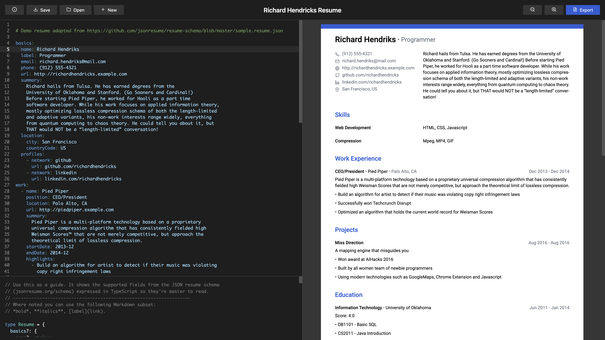

   

<h1 align="center">DevResume</h1>

  <h3>Write your resume in YAML, export in PDF</h3>
  <h5>A free web-based resume editor based on writing YAML with live preview and PDF export. </h5>
  
 

Website: https://devresume.app

**Completely free** • **No sign-up** • **Live preview** • **Works offline** • **Unlimited exports**

## Motivation

DevResume helps developers and technical people to write their resume instead of wrestling with menus. 
The configuration is based on a subset of the [JSON resume standard](https://jsonresume.org/). It includes only the actually useful parts of it. The best practices are already taken care based on the recommendations from the book [The Tech Resume Inside Out](https://thetechresume.com/). You are free to focus on what matters. 

## Scripts

In the project directory, you can run:

#### `npm run dev`
Runs the app in the development mode.\
Open [http://127.0.0.1:5173/](http://127.0.0.1:5173/) to view it in the browser.

#### `npm run build`
Builds the app for production in the `dist` folder.

#### `npm run test`
Runs the unit and integrations tests using Vitest.

#### `npm run test:e2e`
Runs the E2E tests using Playwright.

